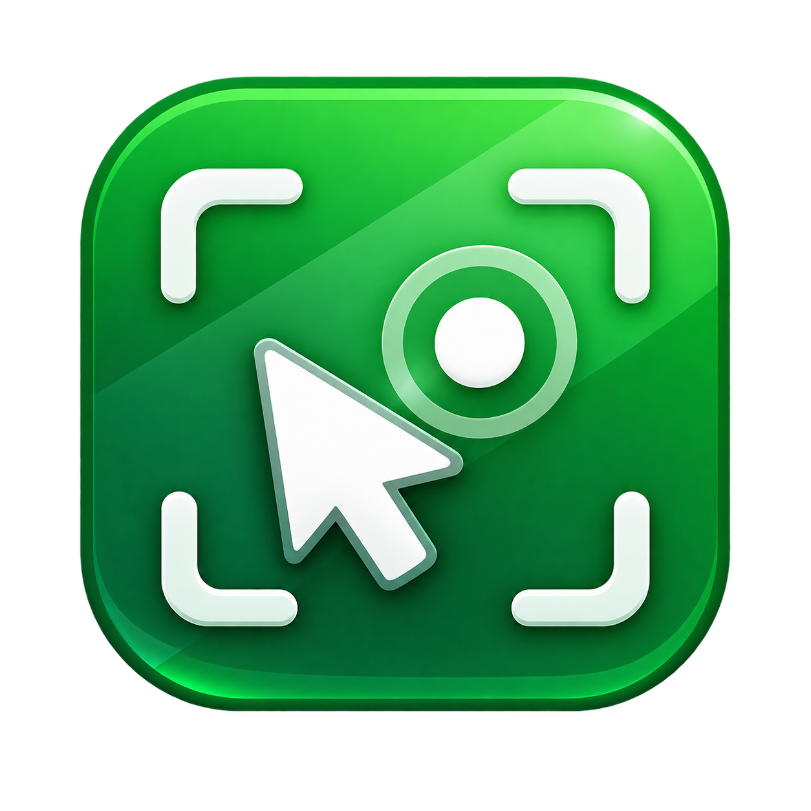

<p align="center">
  
</p>

<h1 align="center">Smart Recorder</h1>

<p align="center">
  A desktop AutoHotkey v2 utility for recording and replaying mouse and keyboard actions, running repeatable test scenarios, and assisting with form automation.
</p>

<p align="center">
  <a href="https://github.com/VseMirka200/smart-recorder/archive/refs/heads/main.zip"></a>
  <a href="README.md"></a>
  <a href="docs/README.md"></a>
  <a href="docs/DEVELOPMENT.md"></a>
  <a href="https://github.com/VseMirka200/smart-recorder/issues/new/choose"></a>
</p>

<p align="center">
  
  
  
</p>

> **Language:** English documentation is available on this page. The main interface of the current application is Russian. For the Russian README, see [README.md](README.md).

## About

Smart Recorder records mouse and keyboard actions and replays them with configurable speed, repetition count, and cooldown intervals. It also includes a test-profile generator, OCR-assisted actions, a status panel, an action journal, automatic recording persistence, and a Windows EXE build script.

The project is intended for automation of your own and test scenarios. Recorded input and screenshots may contain sensitive information, so runtime data should be reviewed before sharing.

## Features

- record mouse and keyboard actions;
- replay recordings at a configurable speed;
- choose the number of full repetitions;
- random cooldown between repetitions;
- automatic saving and loading of the working recording;
- load another recording from the application UI;
- generate a test profile with age and sex;
- optionally generate a new random profile before every repetition;
- OCR assistance for form-related test scenarios;
- `F3` workflow for selecting the required sex option;
- `F4` special answer/screenshot workflow;
- action journal and separate status panel;
- custom application icon for the window, tray, and compiled EXE;
- reproducible `SmartRecorder.exe` build through PowerShell scripts.

## Quick start

### Run from source

1. Install AutoHotkey v2.
2. Clone or [download the repository as ZIP](https://github.com/VseMirka200/smart-recorder/archive/refs/heads/main.zip).
3. If OCR is required, run `Install_OCR.bat`.
4. Start `SmartRecorder.ahk`.

### Build the EXE

Run:

```bat
BUILD_EXE.bat
```

`BUILD_EXE.ps1` prepares AutoHotkey/Ahk2Exe, validates the downloaded AutoHotkey archive, and builds `SmartRecorder.exe` using `SmartRecorder.ico` as the application icon.

See [`docs/DEVELOPMENT.md`](docs/DEVELOPMENT.md) for the full build and development guide.

The `OCR.ahk` dependency can be restored automatically and does not need to be stored in a clean checkout.

## Hotkeys

| Key | Action |
|---|---|
| `F1` | show or hide the action journal |
| `F2` | action using the current profile age |
| `F3` | sex selection workflow |
| `F4` | special answer/screenshot workflow |
| `F5` | generate a new test profile |
| `F6` | enable or disable OCR |
| `F7` | OCR assistant action |
| `F8` | start or stop recording |
| `F9` | start playback |
| `F10` | stop playback |
| `F11` | show or hide the status panel |
| `F12` | show or hide settings |
| `Esc` | exit |

See [`docs/HOTKEYS.md`](docs/HOTKEYS.md) for the detailed reference.

## Main settings

The application window provides controls for:

- repetition count;
- playback speed;
- cooldown range;
- supported time-format examples;
- age range;
- sex mode;
- random profile regeneration before each repetition;
- OCR enable/disable;
- loading another recording.

## Supported time formats

Cooldown fields accept convenient values such as:

```text
3м
3м30с
90с
00:03:30
```

The current UI uses Russian abbreviations for minutes and seconds.

## Repository structure

Documentation is grouped so the repository root stays compact:

```text
SmartRecorder.ahk        main application code
SmartRecorder.ico        Windows application icon
SmartRecorder.png        source icon image
BUILD_EXE.bat            quick build launcher
BUILD_EXE.ps1            PowerShell build script
Install_OCR.bat          manual OCR dependency installer
README.md                Russian project overview
README_EN.md             English project overview
CHANGELOG.md             change history
docs/                    user and technical documentation
.github/                 project policies, support and GitHub templates
```

## Runtime data

During operation, Smart Recorder may create:

```text
recordings/
screenshots/
```

These folders may contain user input or screen contents and should not be committed or published without review.

## Documentation

Central documentation index: **[`docs/README.md`](docs/README.md)**.

- [Changelog](CHANGELOG.md)
- [Development and build](docs/DEVELOPMENT.md)
- [Architecture](docs/ARCHITECTURE.md)
- [Hotkeys](docs/HOTKEYS.md)
- [FAQ](docs/FAQ.md)
- [Troubleshooting](docs/TROUBLESHOOTING.md)
- [Roadmap](docs/ROADMAP.md)
- [Contributing](.github/CONTRIBUTING.md)
- [Support](.github/SUPPORT.md)
- [Security](.github/SECURITY.md)
- [Code of Conduct](.github/CODE_OF_CONDUCT.md)

## Issues and feature requests

Use [GitHub Issues](https://github.com/VseMirka200/smart-recorder/issues/new/choose) for bug reports and feature requests. Dedicated templates are available for both.

Before attaching screenshots, logs, or recordings, remove personal and confidential information.
